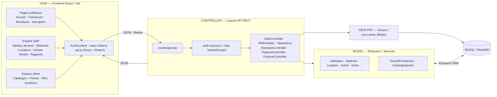
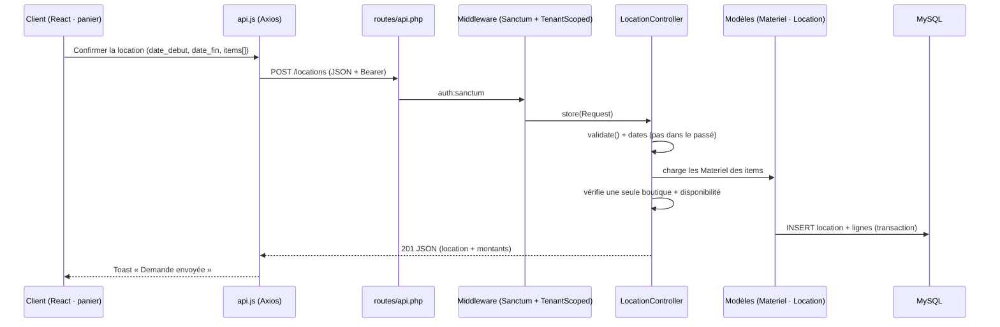

# Rapport d'architecture MVC — TousLocation (version actualisée)

> Application de gestion et de location de matériel — **Laravel 13** (API REST) +
> **React / Vite** (SPA), base **MySQL/MariaDB**, multi-boutiques (SaaS),
> bilingue **français / arabe (RTL)**. Nomenclature 100 % française.

Ce document décrit l'architecture **MVC** de la version à jour : nouvelles
fonctionnalités (place de marché client avec panier, encaissements achats/ventes,
reçus PDF, import de catalogues réels, comptes gérants créés par l'admin) et
nomenclature française appliquée à toutes les couches.

---

## 1. Le patron MVC appliqué au projet

L'application sépare strictement les responsabilités selon le patron
**Modèle-Vue-Contrôleur**, réparti entre un **backend** (API REST Laravel) et un
**frontend** (SPA React) :

| Couche | Rôle | Technologie | Emplacement |
|--------|------|-------------|-------------|
| **Model** | Données, relations, règles métier | Eloquent ORM, Services | `backend/app/Models`, `backend/app/Support` |
| **View** | Présentation | React + Vite (UI) · Blade (PDF) | `frontend/src`, `backend/resources/views` |
| **Controller** | Orchestration, validation, sécurité | Contrôleurs Laravel | `backend/app/Http/Controllers` |

Le frontend joue le rôle de **Vue** principale (interface) ; il consomme le
**Contrôleur** (API REST) qui pilote le **Modèle** (Eloquent). Les **gabarits
Blade** servent uniquement à générer les documents **PDF** (factures, reçus).

---

## 2. Diagramme MVC

Source : [`architecture-mvc.mmd`](architecture-mvc.mmd) (rendu PNG :
[`images/architecture-mvc.png`](images/architecture-mvc.png)).

---

## 3. Couche MODEL

### 3.1 Modèles Eloquent (`backend/app/Models`)

Tous les modèles portent un nom **français** et déclarent explicitement leur table.

| Domaine | Modèles |
|---------|---------|
| Utilisateurs | `Utilisateur` (rôles : `admin`, `manager`, `employee`, `client`) |
| Catalogue | `Materiel`, `Categorie`, `Marque`, `Unite`, `Devise`, `Taxe`, `TypePaiement` |
| Partenaires | `Fournisseur` |
| Locations | `Location`, `LigneLocation`, `Paiement`, `Contrat` |
| Achats | `Achat`, `LigneAchat`, `PaiementAchat` |
| Ventes | `Vente`, `LigneVente`, `PaiementVente` |
| Inventaire | `AjustementStock`, `Depense` |

**Attributs calculés** (exposés dans le JSON via `$appends`) :
`Location`, `Achat` et `Vente` calculent `montant_paye`, `montant_restant` et
`statut_paiement` (`unpaid` / `partial` / `paid`) à partir de leurs paiements ;
`Materiel` expose `url_image` (URL relative ou absolue pour les catalogues importés).

### 3.2 Multi-boutiques (multi-tenant)

Chaque table métier porte une colonne `proprietaire_id` (la boutique / gérant).
L'isolation est assurée par le trait **`TenantScoped`** côté contrôleur :
- un **gérant/employé** ne voit que les données de sa boutique ;
- le **super-admin** voit tout (avec dédoublonnage des référentiels partagés) ;
- un **client** voit ses propres locations, toutes boutiques confondues.

### 3.3 Services (`backend/app/Support`)

- **`TenantProvisioner`** — initialise une nouvelle boutique (devises MAD/EUR/USD,
  TVA marocaines, unités, types de paiement, catégories de départ).
- **`CatalogImporter`** — crée une boutique de démonstration et importe un
  catalogue JSON (matériels, images, descriptions). Utilisé par les commandes
  Artisan `demo:makita` (catalogue Makita, 1268 produits) et `demo:transpalette`.

---

## 4. Couche VIEW

### 4.1 Vue principale — SPA React (`frontend/src`)

Trois espaces, chacun avec sa navigation :

- **Public** : `Landing`, `Login`, `Shops`/`Shop` (vitrine), `RegisterClient`
  (barre `PublicTopbar` : Accueil · Boutiques · langue · Connexion).
- **Staff** (`Layout`, barre latérale filtrée par permissions) : `Dashboard`,
  `Equipments`, `Rentals`, `Clients`, `Suppliers`, `Purchases`, `Sales`,
  `Expenses`, `Adjustments`, `Reports`, `Settings`, `Employees`, `Users`.
- **Client** (`ClientLayout`) : `ClientStore` (catalogue place de marché avec
  recherche, filtre boutique et **panier multi-articles**) et `ClientRentals`.

Services transverses : `AuthContext` (jeton + rôle), `react-i18next` (FR/AR + RTL),
`api.js` (Axios, jeton Bearer, redirection sur 401), composants `Charts` (SVG).

### 4.2 Vue documentaire — Blade PDF (`backend/resources/views`)

- `facture.blade.php` — facture d'une **location** (articles, TVA, paiements, solde).
- `recu-vente.blade.php` — reçu d'une **vente**.

Générés par `FactureController` via **dompdf**.

---

## 5. Couche CONTROLLER

### 5.1 Contrôleurs (`backend/app/Http/Controllers`)

| Groupe | Contrôleurs |
|--------|-------------|
| Authentification | `AuthController` |
| Comptes | `UtilisateurController` (gérants — super-admin), `EmployeController`, `ClientController` |
| Référentiels | `MaterielController`, `CategorieController`, `MarqueController`, `UniteController`, `DeviseController`, `TaxeController`, `TypePaiementController`, `FournisseurController` |
| Opérations | `LocationController`, `PaiementController`, `AchatController`, `VenteController`, `DepenseController`, `AjustementController` |
| Vitrine / Place de marché | `BoutiqueController` (vitrine publique + `/catalogue`) |
| Pilotage | `RapportController`, `TableauBordController` |
| Documents | `FactureController` |
| Transverse | `Concerns/TenantScoped` (trait : `scopeToTenant`, `ownerId`, `ensureOwned`, `requireModule`, dédoublonnage super-admin) |

### 5.2 Sécurité & validation

- **Authentification** : Laravel **Sanctum** (jetons Bearer).
- **Autorisation** : rôles + **modules** par employé (`requireModule`).
- **Validation** : règles dans chaque contrôleur (`$request->validate([...])`).
- **Isolation** : `TenantScoped` sur chaque requête métier.

### 5.3 Routes (`routes/api.php`)

Chemins en français : `/connexion`, `/inscription-client`, `/materiels`,
`/locations`, `/achats`, `/ventes`, `/depenses`, `/catalogue`, `/boutiques`,
`/rapports/benefice`, `/locations/{location}/facture`, etc. Les comptes **gérants**
ne sont créés que par le super-admin (`/utilisateurs`).

---

## 6. Cycle de vie d'une requête — exemple : location depuis le panier client

Points clés de ce flux (place de marché) :
1. **Vue** : le panier (un ou plusieurs articles d'**une même boutique**) envoie
   une période commune (par défaut « maintenant », non modifiable vers le passé).
2. **Contrôleur** (`LocationController`) : valide, vérifie que tous les articles
   appartiennent à la même boutique, contrôle la **disponibilité** (réservations
   concurrentes + jours de battement), calcule au **jour calendaire**.
3. **Modèle** : la location est rattachée à la **boutique du produit** ; le bon
   gérant la gère, et le client la retrouve dans « Mes locations ».

---

## 7. Correspondance Modèle ↔ Contrôleur ↔ Vue ↔ Endpoint

| Modèle | Contrôleur | Vue (React) | Endpoints principaux |
|--------|------------|-------------|----------------------|
| `Materiel` | `MaterielController` | Equipments / ClientStore | `GET/POST /materiels`, `/catalogue`, `/materiels-disponibilite` |
| `Location` | `LocationController` | Rentals / ClientStore / ClientRentals | `GET/POST /locations`, `/locations/{}/confirmer\|retour\|annuler` |
| `Paiement` | `PaiementController` | Rentals | `GET/POST /locations/{}/paiements` |
| `Achat` | `AchatController` | Purchases | `GET/POST /achats`, `/achats/{}/receptionner`, `/achats/{}/paiements` |
| `Vente` | `VenteController` | Sales | `GET/POST /ventes`, `/ventes/{}/paiements`, `/ventes/{}/recu` |
| `Depense` | `DepenseController` | Expenses | `GET/POST/PUT /depenses` |
| `Utilisateur` | `Utilisateur/Employe/Client` | Users / Employees / Clients | `/utilisateurs`, `/employes`, `/clients` |
| Référentiels | `Devise/Taxe/Unite/…` | Settings | `/devises`, `/taxes`, `/unites`, `/types-paiement`, `/categories`, `/marques` |
| — | `BoutiqueController` | Shops / Shop / ClientStore | `/boutiques`, `/boutiques/{}`, `/catalogue` |
| — | `RapportController` | Reports | `/rapports/benefice`, `/rapports/locations` |
| — | `FactureController` | Rentals / Sales | `/locations/{}/facture`, `/ventes/{}/recu` |

---

## 8. Nouveautés de cette version (par rapport au diagramme initial)

- **Nomenclature française** sur toutes les couches (tables, colonnes, modèles,
  contrôleurs, routes, vues) — voir [`NOMENCLATURE-FR.md`](NOMENCLATURE-FR.md).
- **Place de marché client** : `BoutiqueController@catalogue` + panier multi-articles ;
  commande rattachée à la boutique du produit.
- **Encaissements** : `PaiementAchat`, `PaiementVente` + attributs de solde.
- **Reçus PDF de vente** : `FactureController@vente` + `recu-vente.blade.php`.
- **Import de catalogues réels** : `CatalogImporter` + `demo:makita` / `demo:transpalette`.
- **Gouvernance des comptes** : gérants créés par le super-admin uniquement ;
  clients en libre-inscription (sans rattachement obligatoire à une boutique).

---

*Schémas associés : [`database-schema.mmd`](database-schema.mmd) (modèle de données),
[`ui-structure.mmd`](ui-structure.mmd) (arborescence des vues),
[`use-cases.mmd`](use-cases.mmd) (cas d'utilisation).*
